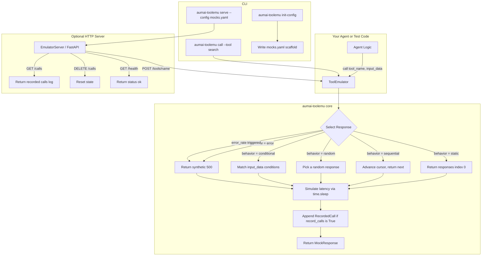

# aumai-toolemu

**Mock tool execution with configurable responses for testing.**

[](https://pypi.org/project/aumai-toolemu/)
[](LICENSE)
[](https://python.org)

---

## What is this?

Imagine you are building a robot assistant that can look things up on the web, run calculations,
and send emails. Before you let the robot loose on the real internet, you want to verify it makes
the right decisions and handles errors gracefully — without actually hitting any real APIs,
spending money on API credits, or accidentally sending emails.

`aumai-toolemu` is a stand-in doubles coach for your AI agent's tools. You describe how each tool
*should* behave, and the emulator impersonates those tools exactly. Your agent calls
`search(query="python tutorials")` and gets back precisely the response you scripted — whether
that is a success result, a 500 error, a slow response, or a random mix of all three.

Think of it like a flight simulator: pilots rehearse emergencies in a simulator long before they
ever face them in the air. `aumai-toolemu` lets your agent rehearse its tool-calling logic in a
safe, repeatable, offline environment.

---

## Why does this matter?

When building AI agents that call external tools, three hard problems appear immediately:

**Problem 1: You cannot control external APIs during testing.**
Real APIs go down, return unexpected data, hit rate limits, and cost money per call. Every test
that touches a real API introduces flakiness and expense.

**Problem 2: You cannot reliably reproduce failure scenarios.**
What happens when `search` returns empty results? What if `calculator` throws a 500? Real failures
are rare and nearly impossible to reproduce on demand — so they go untested.

**Problem 3: CI/CD pipelines cannot hold live credentials.**
You cannot (and should not) put real API keys in CI environment variables. Without keys, you
cannot run the agent. Without running the agent, you cannot test it.

`aumai-toolemu` solves all three problems by replacing real tool calls with a local in-process
(or HTTP server) emulator that returns exactly what you configure — no credentials, no network,
no surprises.

---

## Architecture



---

## Features

| Feature | Description |
|---|---|
| **Static mocking** | Always return the same response — ideal for happy-path unit tests |
| **Sequential responses** | Cycle through a list in order — model multi-turn tool conversations |
| **Random responses** | Pick a response at random — simulate unpredictable third-party APIs |
| **Conditional responses** | Return different responses based on input field values |
| **Error injection** | Set `error_rate: 0.2` so 20 % of calls fail — test your agent's resilience |
| **Latency simulation** | Configure `latency_ms` per response or globally — test timeout handling |
| **Call recording** | Every call is logged with timestamp, input, and response for assertions |
| **HTTP server mode** | Run as a local FastAPI server so any HTTP client can use the emulator |
| **YAML/JSON config** | Describe all mocks in a simple config file that lives in source control |
| **Runtime mock registration** | Add or replace mocks programmatically with `add_mock()` |
| **`ToolNotFoundError`** | Explicit exception when a call is made for an unregistered tool |

---

## Quick Start

### Install

```bash
pip install aumai-toolemu
```

For the HTTP server mode, also install FastAPI and uvicorn:

```bash
pip install "aumai-toolemu[server]"
# or manually:
pip install aumai-toolemu fastapi uvicorn
```

### Your first emulated tool call

```python
from aumai_toolemu import (
    ToolEmulator,
    EmulatorConfig,
    ToolMock,
    MockResponse,
    MockBehavior,
)

config = EmulatorConfig(
    mocks=[
        ToolMock(
            tool_name="search",
            behavior=MockBehavior.static,
            responses=[
                MockResponse(status_code=200, body={"results": ["item_1", "item_2"]})
            ],
        )
    ]
)

emulator = ToolEmulator(config)
response = emulator.call("search", {"query": "python tutorials"})
print(response.status_code)  # 200
print(response.body)         # {'results': ['item_1', 'item_2']}
```

That is the entire loop — no network, no credentials, fully deterministic.

### Using a config file

Generate a starter config:

```bash
aumai-toolemu init-config --output mocks.yaml
```

Invoke from the CLI:

```bash
aumai-toolemu call \
  --tool search \
  --config mocks.yaml \
  --input '{"query": "python"}'
```

### Running the HTTP server

```bash
aumai-toolemu serve --config mocks.yaml --port 9000
```

Test it from another terminal:

```bash
curl -s -X POST http://127.0.0.1:9000/tools/search \
  -H "Content-Type: application/json" \
  -d '{"query": "python tutorials"}'

# Check recorded calls
curl -s http://127.0.0.1:9000/calls | python -m json.tool

# Reset state
curl -s -X DELETE http://127.0.0.1:9000/calls
```

---

## CLI Reference

### `aumai-toolemu init-config`

Generate a starter YAML config file with example mocks so you have something to edit.

```bash
aumai-toolemu init-config [OPTIONS]
```

| Option | Default | Description |
|---|---|---|
| `--output`, `-o` | `mocks.yaml` | Destination file path |
| `--force` | `False` | Overwrite the file if it already exists |

```bash
# Create mocks.yaml in the current directory
aumai-toolemu init-config

# Custom path, overwrite if present
aumai-toolemu init-config --output config/test-mocks.yaml --force
```

---

### `aumai-toolemu serve`

Start the FastAPI-based emulator HTTP server. Binds to localhost by default.

```bash
aumai-toolemu serve --config <FILE> [OPTIONS]
```

| Option | Default | Description |
|---|---|---|
| `--config`, `-c` | required | Path to YAML or JSON config file |
| `--port`, `-p` | `9000` | TCP port to listen on |
| `--host` | `127.0.0.1` | Bind address. Use `0.0.0.0` to expose to local network |

```bash
# Start on the default port
aumai-toolemu serve --config mocks.yaml

# Custom port, exposed to the local network
aumai-toolemu serve --config mocks.yaml --port 8888 --host 0.0.0.0
```

**Available HTTP endpoints once running:**

| Method | Path | Description |
|---|---|---|
| `POST` | `/tools/{tool_name}` | Invoke a mocked tool with optional JSON body |
| `GET` | `/calls` | Return all recorded calls as a JSON array |
| `DELETE` | `/calls` | Clear recorded calls and reset all sequence positions |
| `GET` | `/health` | Health check — returns `{"status": "ok"}` |

---

### `aumai-toolemu call`

Invoke a single emulated tool call and print the response JSON to stdout.

```bash
aumai-toolemu call --tool <NAME> [OPTIONS]
```

| Option | Default | Description |
|---|---|---|
| `--tool`, `-t` | required | Name of the tool to invoke |
| `--input`, `-i` | `{}` | JSON string of input data to pass |
| `--config`, `-c` | None | Config file to load mocks from |
| `--status-code` | `200` | Ad-hoc response status (used when no `--config` is provided) |
| `--response-body` | None | Ad-hoc JSON response body (used when no `--config` is provided) |

```bash
# Use a registered mock from a config file
aumai-toolemu call --tool search --config mocks.yaml --input '{"query": "python"}'

# Quick ad-hoc call — no config file needed
aumai-toolemu call --tool ping --status-code 200 --response-body '{"pong": true}'

# Simulate an error response
aumai-toolemu call --tool my_tool --status-code 503 --response-body '{"error": "unavailable"}'
```

Output format:

```json
{
  "status_code": 200,
  "body": {"results": ["result_1", "result_2"]},
  "headers": {"content-type": "application/json"},
  "latency_ms": 50.0
}
```

---

## Python API Examples

### Happy-path test with static mock

```python
from aumai_toolemu import ToolEmulator, EmulatorConfig, ToolMock, MockResponse

emulator = ToolEmulator(
    EmulatorConfig(
        mocks=[
            ToolMock(
                tool_name="get_weather",
                responses=[
                    MockResponse(status_code=200, body={"temp": 22, "unit": "C"})
                ],
            )
        ]
    )
)

response = emulator.call("get_weather", {"city": "Berlin"})
assert response.status_code == 200
assert response.body["temp"] == 22
```

### Multi-step conversation with sequential responses

```python
from aumai_toolemu import MockBehavior

emulator = ToolEmulator(
    EmulatorConfig(
        mocks=[
            ToolMock(
                tool_name="search",
                behavior=MockBehavior.sequential,
                responses=[
                    MockResponse(status_code=200, body={"results": ["first_page"]}),
                    MockResponse(status_code=200, body={"results": ["second_page"]}),
                    MockResponse(status_code=200, body={"results": []}),  # empty = done
                ],
            )
        ]
    )
)

pages = []
while True:
    r = emulator.call("search", {"query": "cats", "page": len(pages)})
    if not r.body.get("results"):
        break
    pages.extend(r.body["results"])
# pages == ["first_page", "second_page"]
```

### Resilience testing with error injection

```python
import pytest
from aumai_toolemu import ToolNotFoundError

emulator = ToolEmulator(
    EmulatorConfig(
        mocks=[
            ToolMock(
                tool_name="flaky_api",
                behavior=MockBehavior.static,
                error_rate=1.0,  # always fails
                responses=[MockResponse(status_code=200, body={"ok": True})],
            )
        ]
    )
)

response = emulator.call("flaky_api", {})
assert response.status_code == 500
assert response.body["error"] == "injected_error"
```

### Asserting call history

```python
calls = emulator.get_recorded_calls()
assert len(calls) == 3
assert calls[0].tool_name == "search"
assert calls[0].input_data["query"] == "cats"
assert calls[0].timestamp is not None

# Reset between test cases
emulator.reset()
assert emulator.get_recorded_calls() == []
```

### Runtime mock registration

```python
from aumai_toolemu import ToolMock, MockResponse

# Add a new mock without rebuilding the emulator
emulator.add_mock(
    ToolMock(
        tool_name="send_email",
        responses=[MockResponse(status_code=200, body={"message_id": "abc123"})],
    )
)
```

### HTTP server in ASGI tests

```python
import httpx
from aumai_toolemu import EmulatorServer, EmulatorConfig

server = EmulatorServer(config)

# Use the FastAPI app directly with httpx's ASGITransport — no listening port needed
async def test_via_asgi():
    async with httpx.AsyncClient(
        transport=httpx.ASGITransport(app=server.app),
        base_url="http://test",
    ) as client:
        response = await client.post("/tools/search", json={"query": "cats"})
        assert response.status_code == 200
```

---

## Configuration Options

### `EmulatorConfig`

| Field | Type | Default | Description |
|---|---|---|---|
| `mocks` | `list[ToolMock]` | `[]` | All tool mocks registered with this emulator |
| `default_latency_ms` | `float` | `0.0` | Fallback latency applied when a mock response has `latency_ms` of 0 |
| `record_calls` | `bool` | `True` | Whether to record all calls for later inspection |

### `ToolMock`

| Field | Type | Default | Description |
|---|---|---|---|
| `tool_name` | `str` | required | Identifier for the tool — must match what your agent passes to `call()` |
| `behavior` | `MockBehavior` | `static` | Response selection strategy |
| `responses` | `list[MockResponse]` | `[]` | Pool of possible responses |
| `error_rate` | `float` | `0.0` | Probability (0.0–1.0) of injecting a random 500 error |
| `conditions` | `dict \| None` | `None` | Key-value conditions for `conditional` behavior |

### `MockBehavior` values

| Value | Description |
|---|---|
| `static` | Always return `responses[0]` |
| `sequential` | Cycle through responses in order using a per-tool cursor |
| `random` | Pick a response at random using `random.choice` |
| `error` | Always return a synthetic 500 response |
| `conditional` | Return the first response whose `conditions` all match `input_data` |

### `MockResponse`

| Field | Type | Default | Description |
|---|---|---|---|
| `status_code` | `int` | `200` | HTTP-style status code (100–599) |
| `body` | `dict[str, object]` | `{}` | JSON-serializable response body |
| `latency_ms` | `float` | `0.0` | Simulated latency in milliseconds (must be >= 0) |
| `headers` | `dict[str, str]` | `{}` | HTTP-style response headers returned in server mode |

### Full YAML example

```yaml
default_latency_ms: 50.0
record_calls: true
mocks:
  - tool_name: search
    behavior: sequential
    error_rate: 0.0
    responses:
      - status_code: 200
        latency_ms: 50.0
        body:
          results: [result_1, result_2]
        headers:
          content-type: application/json
      - status_code: 200
        latency_ms: 80.0
        body:
          results: []

  - tool_name: calculator
    behavior: static
    error_rate: 0.1
    responses:
      - status_code: 200
        latency_ms: 10.0
        body:
          result: 42
```

---

## How it works — technical deep-dive

### Response selection pipeline

When `ToolEmulator.call(tool_name, input_data)` is called:

1. **Mock lookup** — The emulator looks up `tool_name` in `_mocks: dict[str, ToolMock]`. Raises `ToolNotFoundError` (a `KeyError` subclass) if no mock is registered.
2. **Error rate check** — If `mock.error_rate > 0`, a random float is drawn via `random.random()`. If less than `error_rate`, a synthetic `MockResponse(status_code=500)` is returned immediately, bypassing all other logic.
3. **Behavior dispatch** — Based on `mock.behavior`:
   - `static` — Returns `responses[0]`.
   - `sequential` — Reads `_sequence_positions[tool_name]` (default 0), returns `responses[pos % len(responses)]`, increments the cursor.
   - `random` — Returns `random.choice(responses)`.
   - `error` — Returns a synthetic 500 unconditionally.
   - `conditional` — Iterates `responses` and checks whether all `mock.conditions` keys match values in `input_data`. Returns the first match, or `responses[-1]` as a fallback.
4. **Latency simulation** — Calls `time.sleep(latency_ms / 1000.0)` using the response-level latency if > 0, otherwise `default_latency_ms`.
5. **Call recording** — If `record_calls` is `True`, appends a `RecordedCall` with tool name, input, response, and UTC timestamp.

### HTTP server architecture

`EmulatorServer` wraps a `ToolEmulator` in a FastAPI application built by `_build_fastapi_app()`. The FastAPI import is deferred inside that function, so the module loads in environments without FastAPI installed. `POST /tools/{tool_name}` accepts an optional JSON body, delegates to `emulator.call()`, and returns a `JSONResponse` using the mock's `status_code`, `body`, and `headers`. `HTTPException(404)` is raised for unregistered tools.

### Thread safety

`ToolEmulator` is not thread-safe. The `_sequence_positions` cursor and `_recorded_calls` list are updated without locks. For concurrent workloads, create one emulator instance per thread or test worker.

---

## Integration with other AumAI projects

| Project | How it integrates |
|---|---|
| `aumai-specs` | Use `ToolEmulator` in generated test suites to mock tool calls |
| `aumai-safetool` | Validate mock tool definitions don't contain injection vectors before loading |
| `aumai-template-verify` | Your project's `tests/` directory satisfies the template check when it uses `aumai-toolemu` |

---

## Contributing

Contributions are welcome. Please read `CONTRIBUTING.md` for guidelines.

1. Fork the repository and create a feature branch: `feature/your-feature`
2. Write tests alongside implementation in `tests/`
3. Run `make lint` and `make test` before opening a pull request
4. Follow conventional commits: `feat:`, `fix:`, `refactor:`, `docs:`, `test:`, `chore:`

---

## License

Apache 2.0 — see [LICENSE](LICENSE) for details.
